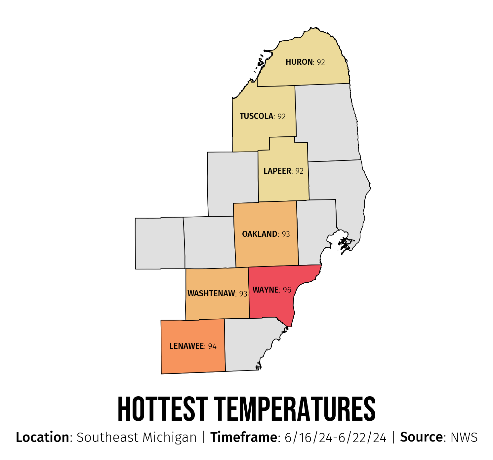

# 0013_matplotlib-Charts
Making Beautiful Maps in matplotlib. Below is the example from this repo:

See [0013_matplotlib-Charts.ipynb](https://github.com/atseewal/0013_matplotlib-Charts/blob/c4e738de0728cf59c13658d0199d03de916dfe85/0013_matplotlib-Charts.ipynb) for the code and walkthrough.